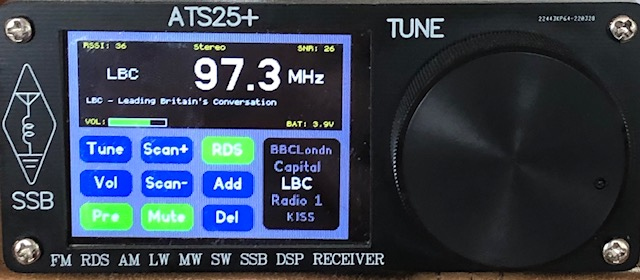
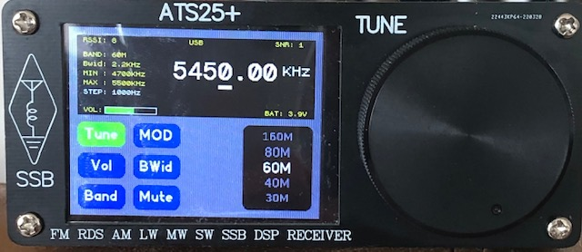

# ATS-25 Radio programmed with Espruino

These all-band (FM,LW,MW,SW with SSB) radios (see picture below) are available on AliExpress and Ebay. They consist of an SI4732-A10 chip which provides the radio functions driven via I2C by an ESP32 WROOM module which implements the display interface. This is an ILI9341 (with XPT2046 touch ) 320x240 pixel display.


There is an extensive well documented Arduino library for the SI4732 and a sketch which implements the firmware running on the pictured radio. The firmware can easily be updated from Arduino via the USB-C port at the rear of the radio. However, the combined library and sketch  is over 10,000 lines of C++ which makes it cumbersome to change so I had a go at an Espruino version. The Espruino implementation is not as responsive as the Arduino software, however, it permits rapid experimentation using the [Espruino IDE](https://www.espruino.com/ide/).

The SI4732 essentially supports three separate radio modes, FM, AM (including SW) and SSB (via a patch). The set of commands and properties supported by these three modes is not the same although there is overlap - for example SSB does not have a scan command. Consequently, to facilitate experimentation and to simplify interfaces, each of the three modes is supported by a different radio app invoked from the home screen shown below:


## FM Radio

The FM radio application supports RDS and stations can be saved as presets in the list on the right of the screen shown below using the RDS information.



A video clip of the FM radio can be seen [here](https://www.youtube.com/watch?v=Yk6XuBNn9mA).

## AM Radio

The AM wavebands shown in the window on the right of the screen can be scolled through using the rotary controller. They are defined in a file stored in Espruino storage. This file ```bands.json``` can be easily modified using the Espruino IDE.


## SSB Radio

There is a short delay  - caused by the need to load the SSB patch into the SI4732 - before the SSB radio app launches. The wavebands are stored in the same ```bands.json``` file as for the AM radio.



The tuning increment can be changed to 10,000Hz, 1000Hz, 100Hz or 10Hz using the rotary controller button - see 1000Hz underline in screen shot. Tuning uses the SSB patch BFO property to minimise 'chuff' on tuning to a different frequency using the tune command.

## Direct Frequency Input

Each of the above three radio apps permits a user to directly input the desired frequency to tune to using the touch screen keypad shown below. This is accessed by swiping down on the screen.


## Technical Challenges

There were a few technical challenges in getting this to work in Espruino. Firstly, the display and touch controller share the SPI bus and while the screen SPI runs at 20MHz, touch only works with SPI at around 2MHz so you have to re setup SPI each time there is a touch interrupt. This generates a new SPI reference which needs to be passed back to the `lcd_spi_unbuf` driver. I implemented a simple additional function in this driver to pass back the SPI reference. 

Secondly, the rotary controller does two increments every click which is not ideal and the module in the Espruino library seems to generate a lot of spurious increments. I implemented a new driver based on an elegant idea outlined [here](http://www.technoblogy.com/show?1YHJ).

Lastly, the rotary controller knob press switch is connected to D33 which cannot be used in `setWatch` in the current ESP32 Espruino. Indeed it did not work as a digital input at all so I implemented a simple polled routine which used `analogRead` to detect the press event.

## TO BE DONE

Installation instructions


