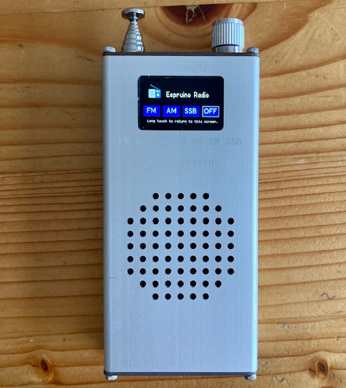
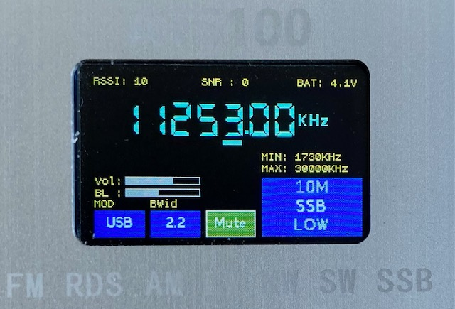

# ATS100 Radio programmed with Espruino

The SI4732 essentially supports three separate radio modes, FM, AM (including SW) and SSB (via a patch). The set of commands and properties supported by these three modes is not the same although there is overlap - for example SSB does not have a scan command. Consequently, to facilitate experimentation and to simplify interfaces, each of the three modes is supported by a different radio app invoked from the home screen shown below:



In contrast to the ATS-25 which has a touch screen, all interaction is via the rotary controller. To select a button or a control such as the BAND selector, turn the knob until the button/control is highlighted, then push the button to activate. 

Each of the radio apps saves frequency, volume, brightness and bandwidth settings on exit and these are restored the next time the app is entered. 

## FM Radio

The FM radio application supports RDS and stations can be saved as presets in the list on the right of the screen shown below using the RDS information.


## AM Radio

The AM wavebands shown in the window on the right of the screen can be scolled through using the rotary controller. They are defined in a file stored in Espruino storage. This file ```bands.json``` can be easily modified using the Espruino IDE.


## SSB Radio

There is a short delay  - caused by the need to load the SSB patch into the SI4732 - before the SSB radio app launches. The wavebands are stored in the same ```bands.json``` file as for the AM radio.



The tuning increment can be changed to 10,000Hz, 1000Hz, 100Hz or 10Hz using the rotary controller button - see 1000Hz underline in screen shot. Tuning uses the SSB patch BFO property to minimise 'chuff' on tuning to a different frequency using the tune command.

## Direct Frequency Input

Each of the above three radio apps permits a user to directly input the desired frequency to tune by double clicking with the pushbutton on the frequency display.


## Installation instructions

**  WARNING: This will wipe the existing firmware on the ATS100 and the only way to recover is to rebuild the original Arduino software from [here](https://github.com/ralphxavier/SI4735) - which I have not tested and which may not work - see disclaimer at that repository.

There are two steps to installing the software.

1) Install modified Espruino interpreter from this repository using ```esptool```. 
   The esptool paramemters can be found in [README_flash.txt](../espruino_2v13.11_esp32/README_flash.txt).
   For further information on installing Espruino on the ESP32 see the [Espruino Website](https://www.espruino.com/ESP32).

After loading the binaries and resetting the ESP32, it should now be possible to connect to the ESP32 using the Espruino [WebIDE](https://www.espruino.com/ide/). - see [here](https://www.espruino.com/Programming) for further information.  Note that it requires Web Serial to be enable the browser  I use Chrome and Chromium. When you connect, a REPL prompt should appear.

2) The next step is to load the set of Javascript files using the WebIDE. The following is the list of files, some of which need to be renamed when loading. To load a file click the disk icon - three down - on the central panel of the IDE.

```
boot0.js -> .boot0
bootcde.js -> .bootcde
encode.js 
// all the javascript file in the ats100 folder
```

This is rather laborious as the current Espruino app loader does not support Web Serial.

## DISCLAIMER

There is no guarantee that this will  work on your ATS100 without modification. 


